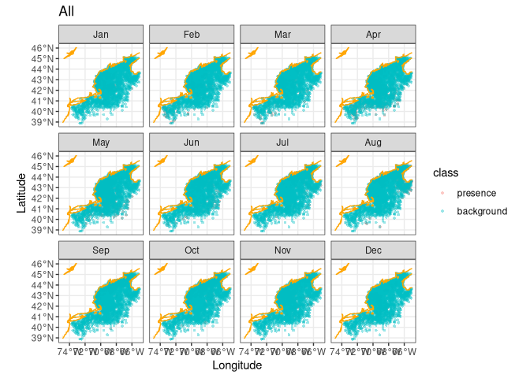

Assignment 3
================

``` r
knitr::opts_chunk$set(echo = TRUE)
source("/home/lnblom28/ColbyForecasting/setup.R")
coast = read_coastline()
obs = read_observations(scientificname = "Phocoena phocoena")
db = brickman_database() |>
  filter(scenario == "STATIC", var == "mask")
mask = read_brickman(db)
```

## Read the Secondary Species

In order to save the species into a variable, it must be downloaded
first. Then it saves the information into the variable mackerel.

``` r
mackerel = fetch_obis(scientificname = "Scomber scombrus")
```

    ## Retrieved 5000 records of approximately 46894 (10%)Retrieved 10000 records of
    ## approximately 46894 (21%)Retrieved 15000 records of approximately 46894
    ## (31%)Retrieved 20000 records of approximately 46894 (42%)Retrieved 25000
    ## records of approximately 46894 (53%)Retrieved 30000 records of approximately
    ## 46894 (63%)Retrieved 35000 records of approximately 46894 (74%)Retrieved 40000
    ## records of approximately 46894 (85%)Retrieved 45000 records of approximately
    ## 46894 (95%)Retrieved 46894 records of approximately 46894 (100%)

## Filter the data

We can use the “read_observation()” function to filter out the NA’s and
the information that is not needed. Then it will give a summary, to make
sure the NA’s have been taken out for event year, individual count,
month, and year.

``` r
mackerel = read_observations(scientificname = "Scomber scombrus")
summary(mackerel)
```

    ##       id            basisOfRecord        eventDate               year     
    ##  Length:28291       Length:28291       Min.   :1970-03-16   Min.   :1970  
    ##  Class :character   Class :character   1st Qu.:2022-08-05   1st Qu.:2022  
    ##  Mode  :character   Mode  :character   Median :2024-07-18   Median :2024  
    ##                                        Mean   :2020-06-01   Mean   :2020  
    ##                                        3rd Qu.:2024-09-04   3rd Qu.:2024  
    ##                                        Max.   :2024-12-24   Max.   :2024  
    ##                                                                           
    ##      month       eventTime         individualCount               geom      
    ##  Aug    :7920   Length:28291       Min.   :   1.000   POINT        :28291  
    ##  Jul    :6201   Class :character   1st Qu.:   1.000   epsg:4326    :    0  
    ##  Sep    :5284   Mode  :character   Median :   1.000   +proj=long...:    0  
    ##  Oct    :5049                      Mean   :   8.986                        
    ##  Nov    :1792                      3rd Qu.:   1.000                        
    ##  Mar    : 851                      Max.   :5899.000                        
    ##  (Other):1194

## Creating Background and Presence Data

Using the code from “C02_background.qmd”, this code creates background
and presence data and stores it in a readable data file for the next
task.

``` r
## Matching the covariates with singular background and present data

#all observations
LON0 = -67
LAT0 = 46
all_counts = count(st_drop_geometry(mackerel), month) # counting is faster without spatial baggage
all_counts
```

    ## # A tibble: 11 × 2
    ##    month     n
    ##    <fct> <int>
    ##  1 Jan       8
    ##  2 Feb     450
    ##  3 Mar     851
    ##  4 Apr     682
    ##  5 May      43
    ##  6 Jul    6201
    ##  7 Aug    7920
    ##  8 Sep    5284
    ##  9 Oct    5049
    ## 10 Nov    1792
    ## 11 Dec      11

## Thinning and Bias

Thinning the data and excluding bias from the data.

``` r
#thinning observations

thinned_obs = sapply(month.abb,
               function(mon){ 
                 thin_by_cell(obs |> filter(month == mon), mask)
               }, simplify = FALSE) |>
  dplyr::bind_rows() 

# another count
thinned_counts = count(st_drop_geometry(thinned_obs), month)


#excluding bias
bias_map = rasterize_point_density(obs, mask) # <-- note the original


#balancing background months
nback_avg = mean(all_counts$n) |>
  round()
```

## Orders the months

Puts the months in order and puts them into a table

``` r
obsbkg = sapply(month.abb,
    function(mon){ 
      sample_background(thinned_obs |> filter(month == mon), # <- just this month
                       bias_map,
                       method = "bias",  # <-- it needs to know it's a bias map
                       return_pres = TRUE, # <-- give me the obs back, too
                       n = nback_avg) |>   # <-- how many points
        mutate(month = mon, .before = 1)
    }, simplify = FALSE) |>
  bind_rows() |>
  mutate(month = factor(month, levels = month.abb))
```

## Plots background and presence on map

This plots the background and presence into 12 maps with each month.

``` r
ggplot() +
  geom_sf(data = obsbkg, 
          mapping = aes(col = class),
          alpha =  0.4, shape = "circle small", size = 1) +
  geom_sf(data = coast, col = "orange")  + 
  labs(x = "Longitude", y = "Latitude", title = "All") +   
  theme_bw() +  # <- make a simple white background
  scale_fill_okabe_ito() +  # <-- colorblind friendly for N Record
  facet_wrap(~month)
```

<!-- -->

``` r
#then save the file
write_model_input(obsbkg, scientificname = "Scomber scombrus")
```
