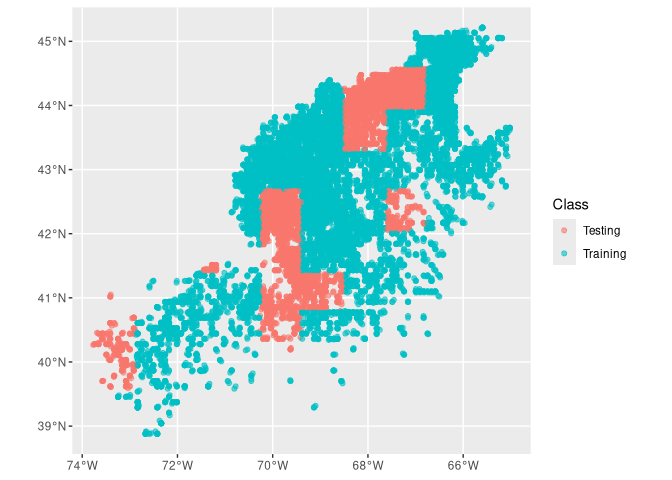
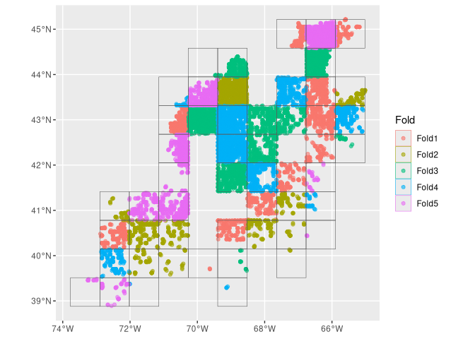
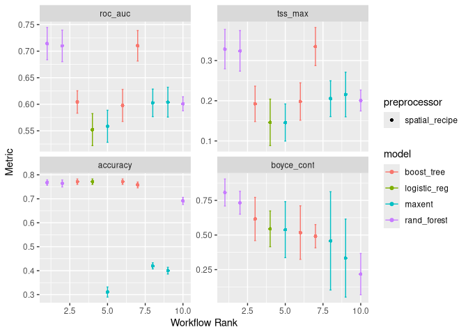
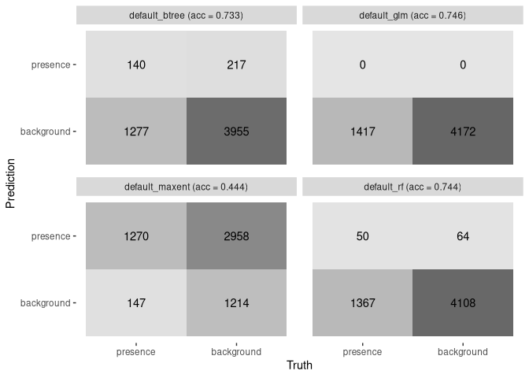
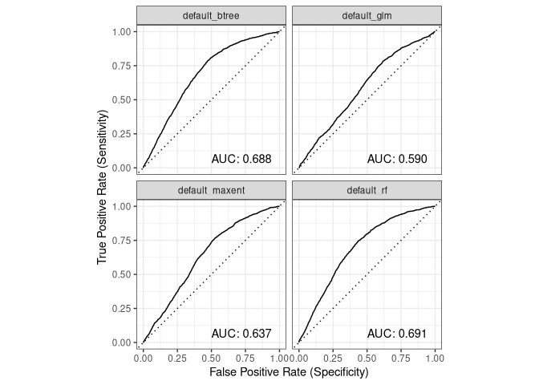
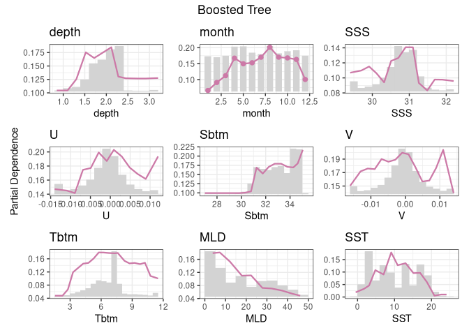

C04_assignment
================

## Setup

Setting up the R code to make sure necessary packages are loaded into
the project.

``` r
source("/home/lnblom28/ColbyForecasting/setup.R")
```

## Load dataing data

We will load the data that we saved before, when splitting our
information into background and presence. In my case, we are using the
version 1 file of Phocoena phocoena. We also make months as numbers,
while also making the depth and stress at bottom on a log scale to more
easily understand the data.

``` r
cfg = read_configuration(scientificname = "Phocoena phocoena", version = "v1")
model_input = read_model_input(scientificname = "Phocoena phocoena", 
                               version = "v1",
                               log_me = c("depth", "Xbtm")) |>
  dplyr::mutate(month = month_as_number(.data$month)) |>
  select(all_of(c("class", cfg$keep)))
```

## Splitting the data into training and testing

We set 80% of the data to train the models, while the 20% for used
later. This code splits the data.

## Initial split into training and testing groups

``` r
model_input_split = spatial_initial_split(model_input, 
                        prop = 1 / 5,     # 20% for testing
                        strategy = spatial_block_cv) # see ?spatial_block_cv
model_input_split
```

    ## <Training/Testing/Total>
    ## <14650/5589/20239>

There are 4 times more training points compared to the testing points.

``` r
autoplot(model_input_split)
```

<!-- -->

## The training groups get split into regions

We take the training data and make it spatial.

``` r
tr_data = training(model_input_split)
cv_tr_data <- spatial_block_cv(tr_data,
  v = 5,     
  cellsize = grid_cellsize(model_input),
  offset = grid_offset(model_input) + 0.00001
)
autoplot(cv_tr_data)
```

<!-- -->

# Building a recipe

This is buliding a recipe for the models. This shows what data the
models will use to execute what we want it to.

``` r
one_row_of_training_data = dplyr::slice(tr_data,1)
rec = recipe(one_row_of_training_data, formula = class ~ .)
rec
```

    ## 

    ## ── Recipe ──────────────────────────────────────────────────────────────────────

    ## 

    ## ── Inputs

    ## Number of variables by role

    ## outcome:   1
    ## predictor: 9
    ## coords:    2

This shows the number of variables that the models will be using. The
coordinates are in the coords rather than the predictor. The line below
shows a more in-depth result of the recipe.

``` r
summary(rec)
```

    ## # A tibble: 12 × 4
    ##    variable type      role      source  
    ##    <chr>    <list>    <chr>     <chr>   
    ##  1 depth    <chr [2]> predictor original
    ##  2 month    <chr [2]> predictor original
    ##  3 SSS      <chr [2]> predictor original
    ##  4 U        <chr [2]> predictor original
    ##  5 Sbtm     <chr [2]> predictor original
    ##  6 V        <chr [2]> predictor original
    ##  7 Tbtm     <chr [2]> predictor original
    ##  8 MLD      <chr [2]> predictor original
    ##  9 SST      <chr [2]> predictor original
    ## 10 X        <chr [2]> coords    original
    ## 11 Y        <chr [2]> coords    original
    ## 12 class    <chr [3]> outcome   original

Each input variable is in the categories of predictor, coordinates and
outcome.

# Creating a workflow for the model

The workflows include our desired models that we will use.

These four models:

- glm: [generalized linear
  model](https://en.wikipedia.org/wiki/Generalized_linear_model)

- rf: [random forest](https://en.wikipedia.org/wiki/Random_forest)

- gbm: [boosted regression
  trees](http://download.nust.na/pub3/cran/web/packages/dismo/vignettes/brt.pdf)

- maxent: [maximum
  entropy](https://en.wikipedia.org/wiki/Principle_of_maximum_entropy)

The hyperparameters are tuned here.

``` r
wflow = workflow_set(
  
  preproc = list(default = rec), # not much happening in our preprocessor
  
  models = list(                 # but we have 4 models to add
    
      # very simple - nothing to tune
      glm = logistic_reg(
          mode = "classification") |>
        set_engine("glm"),
      
      # two knobs to tune
      rf = rand_forest(
          mtry = tune(),
          trees = tune(),
          mode = "classification") |>
        set_engine("ranger", 
                   importance = "impurity"),
      
      # so many things to tune!
      btree = boost_tree(
          mtry = tune(), 
          trees = tune(), 
          tree_depth = tune(), 
          learn_rate = tune(), 
          loss_reduction = tune(), 
          stop_iter = tune(),
          mode = "classification") |>
        set_engine("xgboost"),
    
      # just two again
      maxent = maxent(
          feature_classes = tune(),
          regularization_multiplier = tune(),
          mode = "classification") |>
        set_engine("maxnet")
  )
)
wflow
```

    ## # A workflow set/tibble: 4 × 4
    ##   wflow_id       info             option    result    
    ##   <chr>          <list>           <list>    <list>    
    ## 1 default_glm    <tibble [1 × 4]> <opts[0]> <list [0]>
    ## 2 default_rf     <tibble [1 × 4]> <opts[0]> <list [0]>
    ## 3 default_btree  <tibble [1 × 4]> <opts[0]> <list [0]>
    ## 4 default_maxent <tibble [1 × 4]> <opts[0]> <list [0]>

## Choosing metrics that will decide which model is the best

We will use four metrics. The authors, [tidysdm R
package](https://evolecolgroup.github.io/tidysdm/) have a preferred set:
[Boyce Continuous
Index](https://evolecolgroup.github.io/tidysdm/reference/boyce_cont.html),
[True Skill
Statistic](https://evolecolgroup.github.io/tidysdm/reference/tss_max.html)
and [Area Under the Receiver Operator
Curve](https://evolecolgroup.github.io/tidysdm/reference/prob_metrics_sf.html).
We will also use accuracy along with the default set.

``` r
metrics = sdm_metric_set(yardstick::accuracy)
metrics
```

    ## A metric set, consisting of:
    ## - `boyce_cont()`, a probability metric | direction: maximize
    ## - `roc_auc()`, a probability metric    | direction: maximize
    ## - `tss_max()`, a probability metric    | direction: maximize
    ## - `accuracy()`, a class metric         | direction: maximize

## Hyperparameters

The parameters help set up the model to see what is needed to do the
calculations.

The parameters get varied to se them where it is just right.

### Iteration for finding parameter sets.

We will send minions to do what we need to set up for our models and
predictions.

``` r
wflow <- wflow |>
  workflow_map("tune_grid",
    resamples = cv_tr_data, 
    grid = 3,
    metrics = metrics, 
    verbose = TRUE)
```

    ## i    No tuning parameters. `fit_resamples()` will be attempted

    ## i 1 of 4 resampling: default_glm

    ## ✔ 1 of 4 resampling: default_glm (5s)

    ## i 2 of 4 tuning:     default_rf

    ## i Creating pre-processing data to finalize 1 unknown parameter: "mtry"

    ## ✔ 2 of 4 tuning:     default_rf (9m 20.2s)

    ## i 3 of 4 tuning:     default_btree

    ## i Creating pre-processing data to finalize 1 unknown parameter: "mtry"

    ## → A | warning: `early_stop` was reduced to 0.

    ## There were issues with some computations   A: x1There were issues with some computations   A: x2There were issues with some computations   A: x3There were issues with some computations   A: x4There were issues with some computations   A: x5There were issues with some computations   A: x5
    ## ✔ 3 of 4 tuning:     default_btree (1m 50.9s)
    ## i 4 of 4 tuning:     default_maxent
    ## ✔ 4 of 4 tuning:     default_maxent (7.2s)

Plot of each of the outputs

``` r
autoplot(wflow)
```

<!-- --> general
linearized models only have one parameter, that is why there is only one
here.

### Choosing what the best hyperparameters is for each model

We will save the best hyperparameter for each of the models into a file.

``` r
model_fits = workflowset_selectomatic(wflow, model_input_split,
                                  filename = "Phocoena_phocoena-v1-model_fits",
                                  path = data_path("models"))
model_fits
```

    ## # A tibble: 4 × 7
    ##   wflow_id  splits               id    .metrics .notes   .predictions .workflow 
    ##   <chr>     <list>               <chr> <list>   <list>   <list>       <list>    
    ## 1 default_… <split [14650/5589]> trai… <tibble> <tibble> <tibble>     <workflow>
    ## 2 default_… <split [14650/5589]> trai… <tibble> <tibble> <tibble>     <workflow>
    ## 3 default_… <split [14650/5589]> trai… <tibble> <tibble> <tibble>     <workflow>
    ## 4 default_… <split [14650/5589]> trai… <tibble> <tibble> <tibble>     <workflow>

We get out 4 models.

## Looking at the model fit results

We can look at the representations of the fitted models.

### A table of metrics

We can look at the summary.

``` r
model_fit_metrics(model_fits)
```

    ## # A tibble: 4 × 5
    ##   wflow_id       accuracy boyce_cont roc_auc tss_max
    ##   <chr>             <dbl>      <dbl>   <dbl>   <dbl>
    ## 1 default_glm       0.746     0.846    0.590   0.166
    ## 2 default_rf        0.744     0.870    0.691   0.310
    ## 3 default_btree     0.733     0.0637   0.688   0.314
    ## 4 default_maxent    0.444     0.956    0.637   0.240

### Confusion matrices and accuracy

We can plot the confusion matricies as well as the accuracy.

``` r
model_fit_confmat(model_fits)
```

<!-- -->
\### ROC/AUC

We can collate plots of Receiver Operator Curves (ROC) from which the
Area Under the Curve (AUC) is computed.

``` r
model_fit_roc_auc(model_fits)
```

<!-- -->

### Variable importance

Variable importance shows how important each variable is to contributing
to the whole.

``` r
model_fit_varimp_plot(model_fits)
```

<!-- -->

## Looking at a single model fit result

Looking at one of the models.

``` r
rf = model_fits |>
  filter(wflow_id == "default_rf")
rf
```

    ## # A tibble: 1 × 7
    ##   wflow_id  splits               id    .metrics .notes   .predictions .workflow 
    ##   <chr>     <list>               <chr> <list>   <list>   <list>       <list>    
    ## 1 default_… <split [14650/5589]> trai… <tibble> <tibble> <tibble>     <workflow>

#### `splits`

The allocation of the training and testing locations.

``` r
autoplot(rf$splits[[1]])
```

<!-- -->

#### `.metrics`

Metrics associated with the best hyperparameters.

``` r
rf$.metrics[[1]]
```

    ## # A tibble: 4 × 4
    ##   .metric    .estimator .estimate .config        
    ##   <chr>      <chr>          <dbl> <chr>          
    ## 1 accuracy   binary         0.744 pre0_mod0_post0
    ## 2 boyce_cont binary         0.870 pre0_mod0_post0
    ## 3 roc_auc    binary         0.691 pre0_mod0_post0
    ## 4 tss_max    binary         0.310 pre0_mod0_post0

#### `.predictions`

Testing data predictions are listed here.

``` r
rf$.predictions[[1]]
```

    ## # A tibble: 5,589 × 6
    ##    class    .pred_class .pred_presence .pred_background  .row .config        
    ##    <fct>    <fct>                <dbl>            <dbl> <int> <chr>          
    ##  1 presence background          0.233             0.767     7 pre0_mod0_post0
    ##  2 presence background          0.249             0.751    16 pre0_mod0_post0
    ##  3 presence background          0.213             0.787    22 pre0_mod0_post0
    ##  4 presence background          0.251             0.749    23 pre0_mod0_post0
    ##  5 presence background          0.276             0.724    31 pre0_mod0_post0
    ##  6 presence background          0.256             0.744    33 pre0_mod0_post0
    ##  7 presence background          0.204             0.796    36 pre0_mod0_post0
    ##  8 presence background          0.0424            0.958    39 pre0_mod0_post0
    ##  9 presence background          0.251             0.749    40 pre0_mod0_post0
    ## 10 presence background          0.188             0.812    44 pre0_mod0_post0
    ## # ℹ 5,579 more rows

#### `.workflow`

The tuned hyperparameters as well as the fitted values are shown in the
workflow.

``` r
rf$.workflow[[1]]
```

    ## ══ Workflow [trained] ══════════════════════════════════════════════════════════
    ## Preprocessor: Recipe
    ## Model: rand_forest()
    ## 
    ## ── Preprocessor ────────────────────────────────────────────────────────────────
    ## 0 Recipe Steps
    ## 
    ## ── Model ───────────────────────────────────────────────────────────────────────
    ## Ranger result
    ## 
    ## Call:
    ##  ranger::ranger(x = maybe_data_frame(x), y = y, mtry = min_cols(~1L,      x), num.trees = ~2000L, importance = ~"impurity", num.threads = 1,      verbose = FALSE, seed = sample.int(10^5, 1), probability = TRUE) 
    ## 
    ## Type:                             Probability estimation 
    ## Number of trees:                  2000 
    ## Sample size:                      14650 
    ## Number of independent variables:  9 
    ## Mtry:                             1 
    ## Target node size:                 10 
    ## Variable importance mode:         impurity 
    ## Splitrule:                        gini 
    ## OOB prediction error (Brier s.):  0.2036652

### Partial dependence plot

This reflects the relative controbution of the variables. This shows
relative distribution and influence of the variables.

``` r
model_fit_pdp(model_fits, wid = "default_btree", title = "Boosted Tree")
```

<!-- -->

# Recap

We built 4 models and saved it into a workflow, and into a file, so we
can use it later for our predictions.
