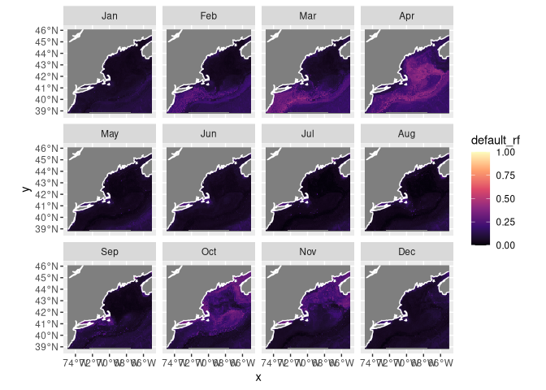
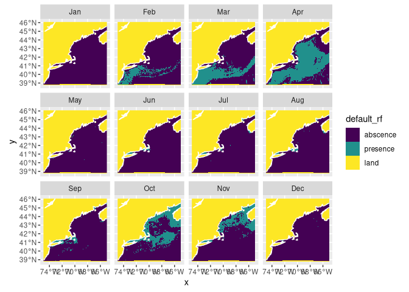
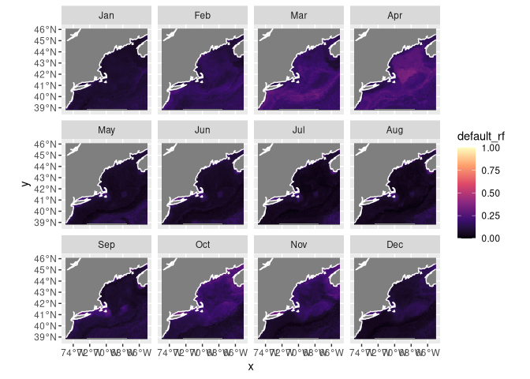
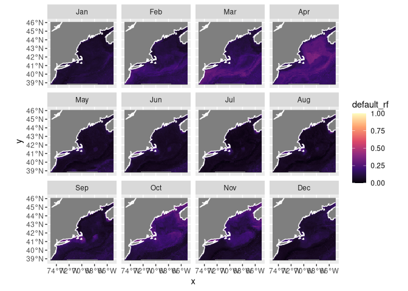
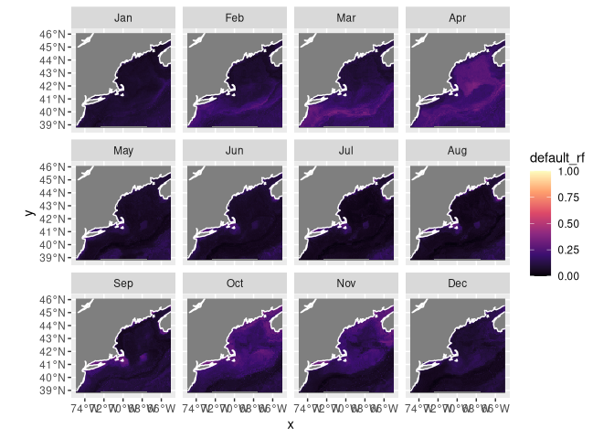

C05_assignemtnt
================

# Setup

Setting up R for our project.

``` r
knitr::opts_chunk$set(echo = TRUE)
source("/home/lnblom28/ColbyForecasting/setup.R")
```

# Load the Brickman data

Loading the brickman data to forecast for the present with nowcast.

``` r
cfg = read_configuration(scientificname = "Scomber scombrus",
                         version = "v1", 
                         path = data_path("models"))
db = brickman_database()
present_conditions = read_brickman(db |> filter(scenario == "PRESENT", 
                                                interval == "mon"),
                       add = c("depth", "month")) |>
  select(all_of(cfg$keep_vars))
```

# Load the workflow

We will read in the file that we saved last time.

``` r
model_fits = read_model_fit(filename = "Scomber_scombrus-v1-model_fits")
model_fits
```

    ## # A tibble: 4 × 7
    ##   wflow_id  splits               id    .metrics .notes   .predictions .workflow 
    ##   <chr>     <list>               <chr> <list>   <list>   <list>       <list>    
    ## 1 default_… <split [17240/3830]> trai… <tibble> <tibble> <tibble>     <workflow>
    ## 2 default_… <split [17240/3830]> trai… <tibble> <tibble> <tibble>     <workflow>
    ## 3 default_… <split [17240/3830]> trai… <tibble> <tibble> <tibble>     <workflow>
    ## 4 default_… <split [17240/3830]> trai… <tibble> <tibble> <tibble>     <workflow>

# Make a prediction

We will create a nowcast variable which will make predictions of what is
happening now.

## Nowcast

This creates the actual variable and takes the observations and does the
calculations.

``` r
nowcast = predict_stars(model_fits, present_conditions)
nowcast
```

    ## stars object with 3 dimensions and 4 attributes
    ## attribute(s):
    ##                         Min.      1st Qu.       Median        Mean      3rd Qu.
    ## default_glm     2.220446e-16 2.220446e-16 2.220446e-16 0.004232119 3.154186e-12
    ## default_rf      5.415400e-03 4.363636e-02 7.597938e-02 0.104459316 1.432847e-01
    ## default_btree   8.707105e-02 8.926214e-02 9.103657e-02 0.100778426 9.105662e-02
    ## default_maxent  2.523209e-03 5.693575e-02 1.673161e-01 0.251369135 3.932759e-01
    ##                      Max.  NA's
    ## default_glm     0.5774868 59796
    ## default_rf      0.4637395 59796
    ## default_btree   0.2205789     0
    ## default_maxent  0.9922794 59796
    ## dimension(s):
    ##       from  to offset    delta refsys point      values x/y
    ## x        1 121 -74.93  0.08226 WGS 84 FALSE        NULL [x]
    ## y        1  89  46.08 -0.08226 WGS 84 FALSE        NULL [y]
    ## month    1  12     NA       NA     NA    NA Jan,...,Dec

Now we will plot on a map of what is calculated.

``` r
plot_prediction(nowcast['default_rf'])
```

    ## numeric

<!-- -->

This plots a abscence/present map with the threshold being 0.5. (the
default)

``` r
pa_nowcast = threshold_prediction(nowcast, threshold = 0.2)
plot_prediction(pa_nowcast['default_rf'])
```

<!-- -->

## Forecast

Now we will forcast using RCP85, for both 2055 and 2075. We loa the
parameters to make the predications, which will be plotted later.

``` r
covars_rcp85_2075 = read_brickman(db |> filter(scenario == "RCP85", 
                                               year == 2075, 
                                               interval == "mon"),
                                  add = c("depth", "month")) |>
  select(all_of(cfg$keep_vars))

covars_rcp85_2055 = read_brickman(db |> filter(scenario == "RCP85", 
                                               year == 2055, 
                                               interval == "mon"),
                                  add = c("depth", "month")) |>
  select(all_of(cfg$keep_vars))
```

``` r
forecast_2075_RCP85 = predict_stars(model_fits, covars_rcp85_2075)
forecast_2075_RCP85
```

    ## stars object with 3 dimensions and 4 attributes
    ## attribute(s):
    ##                         Min.      1st Qu.       Median        Mean      3rd Qu.
    ## default_glm     2.220446e-16 2.220446e-16 2.220446e-16 0.004366463 3.392056e-12
    ## default_rf      6.427533e-03 5.664336e-02 9.655410e-02 0.112575068 1.562958e-01
    ## default_btree   8.707105e-02 9.070464e-02 9.103657e-02 0.101048842 9.115229e-02
    ## default_maxent  1.821606e-03 3.802584e-02 1.258462e-01 0.208412333 3.130503e-01
    ##                      Max.  NA's
    ## default_glm     0.5825917 59796
    ## default_rf      0.3733792 59796
    ## default_btree   0.2205789     0
    ## default_maxent  0.9998241 59796
    ## dimension(s):
    ##       from  to offset    delta refsys point      values x/y
    ## x        1 121 -74.93  0.08226 WGS 84 FALSE        NULL [x]
    ## y        1  89  46.08 -0.08226 WGS 84 FALSE        NULL [y]
    ## month    1  12     NA       NA     NA    NA Jan,...,Dec

``` r
forecast_2055_RCP85 = predict_stars(model_fits, covars_rcp85_2055)
forecast_2055_RCP85
```

    ## stars object with 3 dimensions and 4 attributes
    ## attribute(s):
    ##                         Min.      1st Qu.       Median        Mean      3rd Qu.
    ## default_glm     2.220446e-16 2.220446e-16 2.220446e-16 0.004313576 3.376137e-12
    ## default_rf      7.915444e-03 5.905578e-02 9.741795e-02 0.113908163 1.551860e-01
    ## default_btree   8.707105e-02 9.070464e-02 9.103657e-02 0.100699606 9.115229e-02
    ## default_maxent  1.883102e-03 4.228822e-02 1.351150e-01 0.215719414 3.227574e-01
    ##                      Max.  NA's
    ## default_glm     0.5798459 59796
    ## default_rf      0.3695171 59796
    ## default_btree   0.2205789     0
    ## default_maxent  0.9997660 59796
    ## dimension(s):
    ##       from  to offset    delta refsys point      values x/y
    ## x        1 121 -74.93  0.08226 WGS 84 FALSE        NULL [x]
    ## y        1  89  46.08 -0.08226 WGS 84 FALSE        NULL [y]
    ## month    1  12     NA       NA     NA    NA Jan,...,Dec

Plot the points in a map

``` r
plot_prediction(forecast_2075_RCP85['default_rf'])
```

    ## numeric

<!-- -->

``` r
plot_prediction(forecast_2055_RCP85['default_rf'])
```

    ## numeric

<!-- -->

We will now do it for RCP45.

``` r
covars_rcp45_2075 = read_brickman(db |> filter(scenario == "RCP45", 
                                               year == 2075, 
                                               interval == "mon"),
                                  add = c("depth", "month")) |>
  select(all_of(cfg$keep_vars))

covars_rcp45_2055 = read_brickman(db |> filter(scenario == "RCP45", 
                                               year == 2055, 
                                               interval == "mon"),
                                  add = c("depth", "month")) |>
  select(all_of(cfg$keep_vars))
```

``` r
forecast_2075_RCP45 = predict_stars(model_fits, covars_rcp45_2075)
forecast_2075_RCP45
```

    ## stars object with 3 dimensions and 4 attributes
    ## attribute(s):
    ##                         Min.      1st Qu.       Median        Mean      3rd Qu.
    ## default_glm     2.220446e-16 2.220446e-16 2.220446e-16 0.004306382 3.308336e-12
    ## default_rf      7.436161e-03 5.604001e-02 9.288496e-02 0.111588303 1.537161e-01
    ## default_btree   8.707105e-02 9.070464e-02 9.103657e-02 0.100618901 9.115229e-02
    ## default_maxent  1.828002e-03 4.185518e-02 1.361757e-01 0.221487789 3.399987e-01
    ##                      Max.  NA's
    ## default_glm     0.5808271 59796
    ## default_rf      0.3733801 59796
    ## default_btree   0.2205789     0
    ## default_maxent  0.9994734 59796
    ## dimension(s):
    ##       from  to offset    delta refsys point      values x/y
    ## x        1 121 -74.93  0.08226 WGS 84 FALSE        NULL [x]
    ## y        1  89  46.08 -0.08226 WGS 84 FALSE        NULL [y]
    ## month    1  12     NA       NA     NA    NA Jan,...,Dec

``` r
forecast_2055_RCP45 = predict_stars(model_fits, covars_rcp45_2055)
forecast_2055_RCP45
```

    ## stars object with 3 dimensions and 4 attributes
    ## attribute(s):
    ##                         Min.      1st Qu.       Median        Mean      3rd Qu.
    ## default_glm     2.220446e-16 2.220446e-16 2.220446e-16 0.004280568 3.306405e-12
    ## default_rf      8.086393e-03 5.748659e-02 9.497346e-02 0.113192609 1.567903e-01
    ## default_btree   8.707105e-02 9.070464e-02 9.103657e-02 0.100483779 9.251323e-02
    ## default_maxent  1.436469e-03 4.533223e-02 1.474161e-01 0.226500805 3.441761e-01
    ##                      Max.  NA's
    ## default_glm     0.5781590 59796
    ## default_rf      0.3754550 59796
    ## default_btree   0.2205789     0
    ## default_maxent  0.9976147 59796
    ## dimension(s):
    ##       from  to offset    delta refsys point      values x/y
    ## x        1 121 -74.93  0.08226 WGS 84 FALSE        NULL [x]
    ## y        1  89  46.08 -0.08226 WGS 84 FALSE        NULL [y]
    ## month    1  12     NA       NA     NA    NA Jan,...,Dec

``` r
plot_prediction(forecast_2075_RCP45['default_rf'])
```

    ## numeric

<!-- -->

``` r
plot_prediction(forecast_2055_RCP45['default_rf'])
```

    ## numeric

<!-- -->
:::{.callout-note} Don’t forget that [there are other
ways](https://github.com/BigelowLab/ColbyForecasting/wiki/Spatial) to
plot array based spatial data. :::

## Save the predictions

It’s easy to save the predictions (and read then back with
`read_prediction()`).

``` r
# make sure the output directory exists
path = make_path("predictions")

write_prediction(nowcast,
                 scientificname = cfg$scientificname,
                 version = cfg$version,
                 year = "CURRENT",
                 scenario = "CURRENT")
write_prediction(forecast_2075_RCP85,
                 scientificname = cfg$scientificname,
                 version = cfg$version,
                 year = "2075",
                 scenario = "RCP85")
write_prediction(forecast_2055_RCP85,
                 scientificname = cfg$scientificname,
                 version = cfg$version,
                 year = "2055",
                 scenario = "RCP85")
write_prediction(forecast_2075_RCP45,
                 scientificname = cfg$scientificname,
                 version = cfg$version,
                 year = "2075",
                 scenario = "RCP45")
write_prediction(forecast_2055_RCP45,
                 scientificname = cfg$scientificname,
                 version = cfg$version,
                 year = "2055",
                 scenario = "RCP45")
```

# Recap

We made both a nowcast and a predictions using previously saved model
fits. Contrary to Yogi Berra’s claim, it’s actually pretty easy to
predict the future. Perhaps more challenging is to interpret the
prediction. We bundled these together to make time series plots, and we
saved the predicted values.

# Coding Assignment

<div class="callout-note" appearance="simple">

For each each climate scenario create a monthly forecast (so that’s
three time periods: PRESENT, 2055 and 2075 and three scenarios CURRENT,
RCP45, RCP85) and save each to in your `predictions` directory. In the
end you should have 5 files saved (one for PRESENT and two each for 2055
and 2075).

Do the same for your second species. Ohhh, perhaps this a good time for
another R markdown or R script to keep it all straight?

</div>
